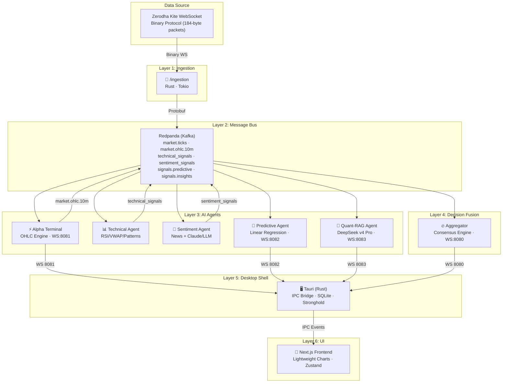

# Alpha Suite (Ai-Trader) — Complete Project Analysis

> **188 source files · ~146K words · 877 interconnected nodes**
> A full-stack AI-powered trading terminal for the Indian stock market (NSE/BSE via Zerodha Kite).

---

## 1. What Is This Project?

**Alpha Suite** is an **AI-powered, real-time trading terminal** built as a **native desktop app** (Tauri + Next.js). It connects to **Zerodha Kite** (India's largest stock broker), ingests live market data, runs it through **4 independent AI/ML agents**, fuses their signals, and presents everything in a professional institutional-grade charting interface.

Think of it as building your own **Bloomberg Terminal** — but with AI brains.

---

## 2. High-Level Architecture



---

## 3. Layer-by-Layer Breakdown

### 3.1 — Data Ingestion (`/ingestion` · Rust)

**Purpose:** Connect to Zerodha Kite's WebSocket, parse binary tick data, and fan it out.

| File | Role |
|------|------|
| `main.rs` | Entry point — authenticates with Kite, starts WS connection |
| `kite_auth.rs` | OAuth token exchange (API key + secret → access token) |
| `kite_client.rs` | WebSocket client — connects to `wss://ws.kite.trade` |
| `parser.rs` | **Binary parser** — decodes Kite's big-endian 184-byte frames into `ParsedTick` structs |
| `kafka_producer.rs` | Publishes parsed ticks as **Protobuf** to Kafka topic `market.ticks` |
| `questdb_sink.rs` / `questdb_writer.rs` | Writes raw ticks to **QuestDB** (time-series DB) for historical archival |
| `types.rs` | Shared type definitions (`ParsedTick` with LTP, OHLC, volume, bid/ask depth) |

**Data Flow:**
```
Kite WS (binary) → parser.rs → ParsedTick
                                 ├─→ kafka_producer → Kafka [market.ticks] (Protobuf)
                                 └─→ questdb_sink → QuestDB (PG wire + ILP)
```

**Key Config:** Symbols come from `.env` → `KITE_INSTRUMENT_TOKENS="738561:RELIANCE,260105:BANKNIFTY"`.

---

### 3.2 — Alpha Terminal (`/alpha-terminal` · Rust · WS:8081)

**Purpose:** Consume raw ticks, aggregate them into **10-minute OHLC candles**, and broadcast to the frontend.

| File | Role |
|------|------|
| `engine.rs` | **Tumbling window OHLC aggregator** — groups ticks into 10-min buckets, tracks open/high/low/close/volume |
| `consumer.rs` | Kafka consumer — reads from `market.ticks` |
| `kafka_producer.rs` | Publishes completed candles to `market.ohlc.10m` |
| `ws_server.rs` | WebSocket server on **port 8081** — broadcasts candle JSON to connected frontends |

**This is the heartbeat of the chart.** Every 10 minutes, a completed `OhlcCandle` is emitted.

---

### 3.3 — Technical Agent (`/agents/technical` · Rust)

**Purpose:** Classical quantitative indicators.

| File | Role |
|------|------|
| `indicators.rs` | Computes **RSI** (14-period) and **VWAP** (Volume-Weighted Average Price) |
| `signal_engine.rs` | Pattern detection: **Golden Cross, Death Cross, ORB Breakout/Breakdown, VWAP Bounce, Bullish/Bearish Engulfing, Doji, Hammer, Shooting Star** |
| `state.rs` | Per-symbol state tracking (rolling windows, indicator warm-up) |
| `kafka_consumer.rs` | Reads from `live_ticks` |
| `kafka_producer.rs` | Publishes `TechSignal` to `technical_signals` |

---

### 3.4 — Sentiment Agent (`/agents/sentiment` · Node.js)

**Purpose:** News headline fetching + AI sentiment scoring.

| File | Role |
|------|------|
| `fetcher.js` | Fetches headlines from **Google News RSS** feeds |
| `analyzer.js` | Core sentiment analysis pipeline |
| `claude.js` | LLM-based sentiment scoring (Claude/DeepSeek) |
| `cache.js` | Response caching to avoid redundant API calls |
| `kafkaProducer.js` | Publishes `NewsSentiment` to `sentiment_signals` |
| `index.js` | Entry point — orchestrates fetch → analyze → publish loop |

---

### 3.5 — Predictive Agent (`/agents/predictive` · Rust · WS:8082)

**Purpose:** Forward price projection using linear regression.

| File | Role |
|------|------|
| `math.rs` | **Least-Squares Linear Regression** on 14-period rolling window of 10m closes |
| `engine.rs` | Consumes `market.ohlc.10m`, runs prediction, calculates **R² confidence score** (1-100) |
| `ws_server.rs` | Broadcasts `PredictiveSignal` on **port 8082** for the Ghost Line overlay |

> [!IMPORTANT]
> The predictive model is **rigidly bound to the 10m timeframe**. On any other timeframe, the Ghost Line is hidden to prevent misleading projections.

---

### 3.6 — Quant-RAG Agent (`/agents/quant-rag` · Rust · WS:8083)

**Purpose:** AI-powered anomaly detection + deep analysis.

| File | Role |
|------|------|
| `engine.rs` | Monitors `market.ohlc.10m` for **≥2% price swings** (`|close-open|/open × 100`) |
| `llm.rs` | REST client for **DeepSeek v4 Pro** via NVIDIA NIM API — generates headline, analysis, sentiment score |
| `ws_server.rs` | Broadcasts `MarketInsight` on **port 8083** |

**Error Visibility:** If DeepSeek API fails, a fallback insight with `headline: "LLM API Failure"` is broadcast — the frontend never silently loses data.

---

### 3.7 — Aggregator / Decision Engine (`/aggregator` · Rust · WS:8080)

**Purpose:** Fuse all agent signals into a single **BUY/SELL/HOLD** decision.

| File | Role |
|------|------|
| `engine.rs` | **ConsensusEngine** — weights technical + sentiment signals, computes `final_conviction_score` |
| `consumer.rs` | Reads from `technical_signals` + `sentiment_signals` |
| `kafka_producer.rs` | Publishes `AggregatedDecision` to `aggregated_decisions` |
| `ws_server.rs` | Broadcasts decisions on **port 8080** |
| `kite_api.rs` | Kite REST API proxy (historical candles, instruments, quotes) with **instrument caching** |
| `ohlc_server.rs` | Additional OHLC serving endpoint |
| `quant/patterns.rs` | Candlestick pattern detection (engulfing, doji, hammer, shooting star) |
| `quant/strategies.rs` | Strategy signals (golden cross, death cross, ORB, VWAP bounce) |
| `state.rs` | Per-symbol state management for the consensus engine |

---

## 4. Infrastructure (Docker Compose)

All backend services are orchestrated via `docker-compose.yml`:

| Service | Image | Ports | Purpose |
|---------|-------|-------|---------|
| **Redpanda** | `redpandadata/redpanda` | 19092, 29092 | Kafka-compatible message broker |
| **QuestDB** | `questdb/questdb` | 9000, 8812, 9009 | Time-series DB (historical candles) |
| **PostgreSQL** | `postgres:16-alpine` | 5890 | Auth database (`ai_trade_auth`) |
| **Redis** | `redis:7-alpine` | 6379 | Session cache for auth |
| **Ingestion** | Custom Rust | — | Kite WS → Kafka |
| **Alpha Terminal** | Custom Rust | 8081 | OHLC engine + WS |
| **Aggregator** | Custom Rust | 8080 | Decision fusion + WS |
| **Predictive** | Custom Rust | 8082 | ML predictions + WS |
| **Quant-RAG** | Custom Rust | 8083 | DeepSeek anomaly detection + WS |

---

## 5. Kafka Topic Map

```
market.ticks          ← Ingestion (raw Zerodha ticks)
    ├─→ Alpha Terminal → market.ohlc.10m (aggregated candles)
    └─→ Technical Agent → technical_signals

market.ohlc.10m
    ├─→ Predictive Agent → signals.predictive
    └─→ Quant-RAG Agent → signals.insights

live_ticks → Sentiment Agent → sentiment_signals

technical_signals + sentiment_signals → Aggregator → aggregated_decisions
```

---

## 6. Protobuf Data Contracts (`/shared_protos`)

| Contract | Key Fields | Kafka Topic |
|----------|-----------|-------------|
| **Tick** | symbol, timestamp_ms, LTP, volume, bid, ask | `market.ticks` |
| **OHLCCandle** | symbol, start/end_timestamp_ms, OHLC, volume | `market.ohlc.10m` |
| **TechSignal** | symbol, RSI, VWAP distance, conviction score | `technical_signals` |
| **NewsSentiment** | symbol, headline, claude_conviction_score | `sentiment_signals` |
| **AggregatedDecision** | symbol, final_conviction_score, BUY/SELL/HOLD | `aggregated_decisions` |
| **PredictiveSignal** | symbol, predicted_close, confidence_score | `signals.predictive` |

---

## 7. Tauri Desktop Shell (`/frontend/src-tauri`)

The frontend runs as a **native desktop app** via Tauri (Rust). The Tauri layer acts as an **IPC bridge** between backend WebSockets and the React UI.

### 7.1 — Boot Sequence ([lib.rs](file:///d:/projects/Ai-trader/frontend/src-tauri/src/lib.rs))

```
1. Load .env (multi-path fallback)
2. Init ActiveSymbolState (default: RELIANCE)
3. Check ALPHA_TEST_MODE → mock mode or live mode
4. Setup Stronghold encrypted vault (Argon2id key derivation)
5. Init SQLite workspace DB (drawings, watchlist persistence)
6. Spawn instrument master sync (NSE CSV download)
7. Spawn Quant Radar worker (50 F&O symbols)
8. Register all IPC command handlers
9. IF test mode → spawn mock OHLC emitter
   IF production → connect QuestDB pool, defer WS bridges
```

### 7.2 — IPC Commands

| Command | File | Purpose |
|---------|------|---------|
| `subscribe_ticker` | `ticker.rs` | Set active symbol + bootstrap live WS bridges |
| `search_instruments` | `instruments.rs` | Search NSE instrument master |
| `get_historical_view` | `charts.rs` | Query QuestDB → bincode → Uint8Array |
| `load_historical` | `charts.rs` | Lazy-load 5yr historical from Kite API → QuestDB |
| `fetch_questdb` | `charts.rs` | Direct QuestDB query |
| `run_deep_quant_analysis` | `deep_quant.rs` | Trigger DeepSeek analysis on demand |
| `fetch_symbol_sentiment` | `sentiment.rs` | News sentiment via Google RSS + LLM |
| `save_api_key` / `check_api_key_exists` | `security.rs` | Stronghold encrypted key management |
| `save_workspace` / `load_workspace` | `db.rs` | SQLite persistence (drawings, watchlist) |
| `log_completed_trade` / `get_trade_history` | `db.rs` | Paper trade logging |

### 7.3 — Services

| Service | File | Purpose |
|---------|------|---------|
| `live_bridges.rs` | WS→IPC bridge for OHLC (8081), Predictive (8082), Insight (8083) |
| `history_loader.rs` | Chunked 5yr backfill from Kite API (365-day windows, 350ms rate limit) |
| `instrument_master.rs` | Daily NSE instrument CSV sync into SQLite |
| `llm.rs` | DeepSeek v4 Pro API client for deep quant analysis |
| `audit_logger.rs` | Trade audit logging |

### 7.4 — Quant Engine (`/frontend/src-tauri/src/quant/`)

| File | Purpose |
|------|---------|
| `mod.rs` | `ConsensusEngine` — computes trend, momentum, volatility, volume flow states |
| `patterns.rs` | Candlestick pattern detection (engulfing, doji, hammer, shooting star) |
| `strategies.rs` | Strategy signals (Golden Cross, Death Cross, ORB, VWAP Bounce) |
| `radar.rs` | **Quant Radar** — scans 50 F&O symbols continuously, emits `radar-alert` events |

---

## 8. Frontend (`/frontend` · Next.js + React)

### 8.1 — State Management (Zustand)

Two stores power the entire UI:

**[useTradeStore.ts](file:///d:/projects/Ai-trader/frontend/src/store/useTradeStore.ts)** — The central brain:
- `selectedSymbol` — active chart symbol (default: RELIANCE)
- `activeProfile` — INTRADAY / SWING / INVESTOR
- `activeTimeframe` — 1m through 1M (default: 10m)
- `activeRange` — data range (1Y, 3Y, 5Y)
- `ohlcCandles[]` — live OHLC buffer (max 3000)
- `predictiveSignals[]` — ghost line data
- `latestInsight` — last DeepSeek market insight
- `historicalCache` — keyed `SYMBOL::kiteInterval` to prevent redundant fetches
- `watchlist[]` — user's curated watchlist (persisted via SQLite)
- `systemLogs[]` — rolling 500-entry diagnostic log
- WebSocket connection managers with auto-reconnect

**[useChartUIStore.ts](file:///d:/projects/Ai-trader/frontend/src/store/useChartUIStore.ts)** — Drawing/UI state:
- Active cursor mode, drawing tool, magnet mode
- Drawing visibility/lock state, color picker

### 8.2 — Data Hooks

| Hook | Purpose |
|------|---------|
| `useTauriLiveData.ts` | Binds Tauri IPC events (`ohlc-tick`, `predictive-tick`, `insight-tick`) to Zustand |
| `useHistoricalData.ts` | Lazy-loads historical candles from QuestDB via Tauri IPC, with intelligent caching |
| `useChartDataSync.ts` | Merges historical + live candles, deduplicates, feeds to Lightweight Charts |
| `useChartInit.ts` | Initializes the Lightweight Charts instance with dark theme config |
| `useDrawingEngine.ts` | Canvas drawing state machine |
| `useDrawingInteraction.ts` | Mouse/touch interaction for drawings |
| `useDrawingRenderer.ts` | Renders drawings onto chart canvas |
| `useFibZoneOverlay.ts` | Fibonacci zone overlay rendering |
| `useMultiTimeframeTrend.ts` | Multi-timeframe trend analysis (1H, 4H, 1D, 1W) |
| `useMacroIndicators.ts` | Macro economic indicators for Investor mode |

### 8.3 — Component Architecture

```
TerminalLayout (header + toolbar + body)
├── LeftPanel (watchlist + search + sentiment)
├── Drawing Toolbar (lines, fibs, patterns, shapes, text, projections)
├── Profile Switcher (Intraday / Swing / Investor)
├── Security Vault (API key management modal)
├── QuantRadar (floating alert overlay)
└── Main Content Area
    ├── IntradayLayout → Chart + OrderBook
    ├── SwingLayout → Chart + SwingConfluencePanel
    └── InvestorLayout → Chart + MacroSentimentPanel
```

### 8.4 — Key Components

| Component | Purpose |
|-----------|---------|
| `AlphaPredictiveChart.tsx` | **The main chart** — Lightweight Charts, EMA 9/21 ribbons, volume histogram, Ghost Line overlay, crosshair |
| `TerminalLayout.tsx` | Master layout — header, profile switcher, drawing toolbar, security vault |
| `LeftPanel.tsx` | Watchlist sidebar with symbol search, quick-switch, sentiment cards |
| `WatchlistPanel.tsx` | Dynamic watchlist with drag-reorder, add/remove, live price updates |
| `OrderBook.tsx` | Level-2 order book DOM (awaits live market depth data) |
| `SystemConsole.tsx` | Bottom drawer — service health dots, pipeline latency, rolling log viewer |
| `QuantRadar.tsx` | Floating overlay — live alerts when institutional strategies fire across 50 symbols |
| `ConsensusBoard.tsx` | Quant consensus display (trend, momentum, volatility, patterns) |
| `DeepQuantPanel.tsx` | On-demand DeepSeek AI analysis panel |
| `ActivePositions.tsx` | Paper trading position tracker |
| `SecurityVault.tsx` | Encrypted API key management via Tauri Stronghold |
| `DrawingOverlays.tsx` | HTML DOM overlay for text-based chart annotations |

### 8.5 — Chart Rendering Pipeline

```
Historical (QuestDB) ──┐
                        ├──→ useChartDataSync → deduplicate → sort by time
Live (WS/IPC ticks) ───┘                                         │
                                                                  ▼
                                                     Lightweight Charts
                                                     .setData() / .update()
                                                     (bypasses React state)
```

> [!TIP]
> Charts bypass React's reconciliation entirely. `setData()` and `update()` are called directly from effects for **zero-latency rendering**.

---

## 9. Authentication System (`/auth` · Node.js + Express)

A complete production auth system with:

| Feature | Implementation |
|---------|---------------|
| **Registration/Login** | Email/password with Argon2 hashing |
| **JWT Tokens** | Access + refresh token rotation |
| **Google OAuth** | Social login integration |
| **MFA** | TOTP-based multi-factor authentication |
| **KYC** | Aadhaar + PAN verification adapters |
| **Billing** | Subscription plans with webhook-based payment processing |
| **Security** | AES-256 encryption, token blacklisting, circuit breaker pattern |

**Database:** PostgreSQL (5 migration files: identity vault, refresh tokens, financial persona, KYC state machine, billing schema)
**Session Cache:** Redis 7

---

## 10. Data Flow Summary (End-to-End)

```
USER CLICKS SYMBOL IN WATCHLIST
    │
    ▼
useTauriLiveData → invoke('subscribe_ticker', { symbol })
    │
    ▼
Tauri Rust Backend:
    ├─ Updates ActiveSymbolState
    ├─ Bootstraps WS bridges (lazy, first call only)
    │   ├─ WS:8081 (OHLC) → emit('ohlc-tick')
    │   ├─ WS:8082 (Predictive) → emit('predictive-tick')
    │   └─ WS:8083 (Insight) → emit('insight-tick')
    └─ Returns to UI

useHistoricalData → invoke('get_historical_view', { symbol, interval })
    │
    ▼
Tauri → QuestDB query → bincode serialize → Uint8Array → frontend decode
    │
    ▼
useChartDataSync → merge historical + live → deduplicate → chart.setData()
    │
    ▼
AlphaPredictiveChart renders:
    ├─ Candlestick series (OHLC)
    ├─ Volume histogram (bottom 20%)
    ├─ EMA 9 (cyan) + EMA 21 (pink) ribbons
    └─ Ghost Line (dashed, 10m only) from PredictiveSignal
```

---

## 11. Test Infrastructure

| Type | Location | Details |
|------|----------|---------|
| **E2E Tests** | `frontend/tests/e2e.spec.ts` | Playwright browser tests |
| **Rust Unit Tests** | `frontend/src-tauri/tests/` | `api_tests.rs`, `quant_tests.rs` — pattern detection, consensus engine |
| **Auth Tests** | `auth/src/__tests__/` | Billing service, webhooks, integration tests |
| **Load Tester** | `tools/load_tester/` | Chaos Engine — 100 candles/sec + anomaly injection for stress testing |
| **Test Mode** | `ALPHA_TEST_MODE` env var | Bypasses all live APIs, emits deterministic mock data |

---

## 12. Key Design Decisions

1. **Rust for everything latency-critical** — Ingestion, OHLC engine, all agents except sentiment
2. **Protobuf over JSON** for Kafka messages — compact binary serialization
3. **Bincode for IPC** — historical data transferred as `Vec<u8>` → `Uint8Array`, not JSON
4. **Lazy loading** — historical data fetched on-demand, not at boot
5. **WS bridges deferred** — only bootstrapped on first `subscribe_ticker` call
6. **Cache keying** — `SYMBOL::kiteInterval` prevents stale data across timeframe switches
7. **Ghost Line constraint** — only visible on 10m timeframe to preserve mathematical integrity
8. **Stronghold vault** — API keys encrypted with Argon2id + AES-256, never stored in plaintext

---

## 13. Port Map (Quick Reference)

| Port | Service | Protocol |
|------|---------|----------|
| 8080 | Aggregator (decisions) | WebSocket |
| 8081 | Alpha Terminal (OHLC candles) | WebSocket |
| 8082 | Predictive Agent (ghost line) | WebSocket |
| 8083 | Quant-RAG (DeepSeek insights) | WebSocket |
| 8812 | QuestDB (PG wire) | PostgreSQL |
| 9000 | QuestDB (web console) | HTTP |
| 9009 | QuestDB (ILP ingestion) | TCP |
| 19092 | Redpanda/Kafka (external) | Kafka |
| 29092 | Redpanda/Kafka (internal) | Kafka |
| 5890 | PostgreSQL (auth DB) | PostgreSQL |
| 6379 | Redis (sessions) | Redis |

---

> **Ready for Part 2?** Ask me about any specific layer — I can go deeper into the consensus engine math, the chart rendering pipeline, the drawing system, the auth flow, or any other subsystem.
